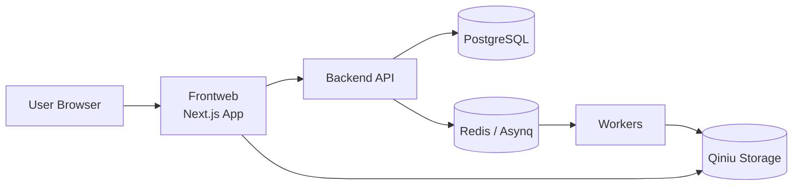
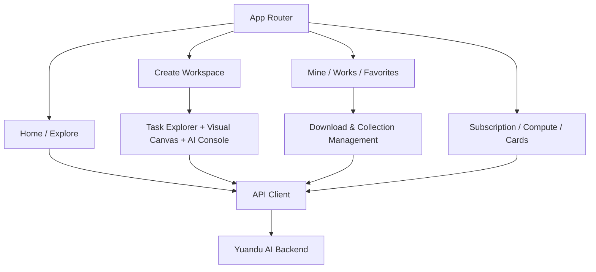

# Yuandu AI Frontweb

> User-facing Visual Asset Portal & AI Creation Workspace

## 1) 定位（Positioning）

本仓库是元都AI用户端前台，承接平台的内容消费与创作转化：

- 视觉资产浏览：合集、单图、专题推荐
- AI 创作工作台：视频转图片任务发起与结果管理
- 个人资产中心：收藏、作品、下载、权益

---

## 2) 平台连接关系（Platform Topology）



---

## 3) 前端模块关系图（Frontend Modules）



---

## 4) 路线图目录（Roadmap）

| 阶段 | 方向 | 状态 |
|---|---|---|
| Phase 1 | 用户消费链路（浏览/收藏/下载）稳定化 | ✅ In Progress |
| Phase 2 | 创作工作台增强（任务可视化、结果筛选、效率优化） | 🚧 In Progress |
| Phase 3 | 创作者协作能力（模板化、批量化、团队化） | 🗓️ Planned |

---

## 5) Tech Stack

- Next.js 16
- React 19
- TypeScript
- Tailwind CSS 4

---

## 6) Quick Start

```bash
npm install
cp .env.example .env.local
npm run dev
```

Default: `http://localhost:5918`

---

## 7) Environment

```bash
NEXT_PUBLIC_API_BASE=/api
```

- Local direct backend: `http://localhost:5050/api`
- Production: recommend Nginx reverse proxy on `/api`

---

## 8) Build & Run

```bash
npm run build
npm run start
```

---

## 9) Deployment

See: [`docs/DEPLOYMENT.md`](./docs/DEPLOYMENT.md)

---

## 10) License

See `LICENSE`.
